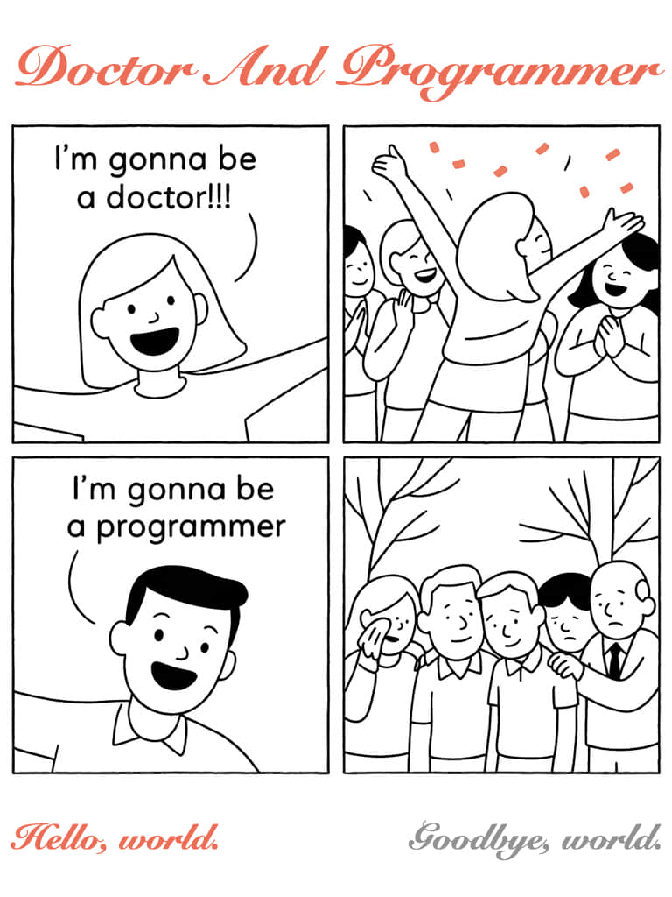
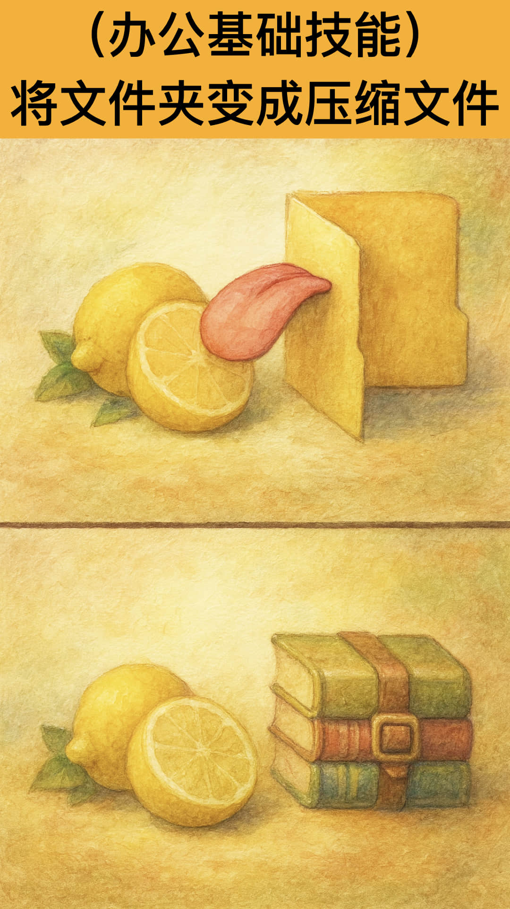

# 程序梗图火炬🗽

---

记住，当你传递一张**程序员梗图**的时候🧑‍💻

你不是在传递一张**发绿的老梗**🔫

你**传递**的📮

**是古典互联网精神最后的火炬！🗽**

---

**本仓库是[zhaoolee的小红书账号](https://www.xiaohongshu.com/user/profile/566a6d770bf90c7076c1f397)的备份**。

---

## 正文(最近更新：2025-09-25)

### 程序员的前任与现任：IDEA VS CURSOR

> [查看小红书评论](http://xhslink.com/o/2xDuFiWSMT3)

### 按量付费 VS 月付订阅

> [查看小红书评论](http://xhslink.com/o/3kipUaI1Z9G)

### PHP是全世界最好的语言！

> [查看小红书评论](http://xhslink.com/o/DXZnlIt1Hr)

### Java VS 曾经的对手 

> [查看小红书评论](http://xhslink.com/o/27Q7dXZ25UW)

### PHP是最好的语言，它快速，强大，免费！ 

> [查看小红书评论](http://xhslink.com/o/1qsb1gMkDpw)

### 你以为的团队编程VS实际的团队编程

> [查看小红书评论](http://xhslink.com/o/4Wfxx0HgbFy)

### Java与Lava（岩浆） 是异父异母的亲兄弟

> [查看小红书评论](http://xhslink.com/m/9CRAvvmeABo)

### 你有牙膏，我有刀法！

> [查看小红书评论](http://xhslink.com/m/8mq0X1te9dk)

### 你发任你发，我用 JAVA八！

> [查看小红书评论](http://xhslink.com/m/4CmsjVpxSNW)

### DeepSeek写代码八荣八耻，要求 AI 每天念一遍！

> [查看小红书评论](http://xhslink.com/m/5WAbc7RWabp)

### 人生苦短，我用满血版!

> [查看小红书评论](http://xhslink.com/m/5Fhz53a55KS)

### Linux笑话：你去把唐僧师徒干掉！

> [查看小红书评论](http://xhslink.com/m/7PBmqodo7gK)

### 程序员养生道：能跑就行，能抄就抄，多看少改

> [查看小红书评论](http://xhslink.com/m/5dGIwQnAiSv )

### 歪脖编程：程序员，下来吧，我们保证不乱改你代码了

> [查看小红书评论](http://xhslink.com/m/16J02PtI7Kv )

### 程序员的口语-实用首字母缩写 OOO

> [查看小红书评论](http://xhslink.com/m/6ducCeWXtIM)

### 程序员的口语-实用首字母缩写 LGTM

> [查看小红书评论](http://xhslink.com/m/6ducCeWXtIM)

### 程序员的口语-礼貌用语（No rush）

> [查看小红书评论](http://xhslink.com/m/6ducCeWXtIM)

### 程序员的口语-DevOps/release

> [查看小红书评论](http://xhslink.com/m/73gpj759KvB)

### 程序员的口语-Frontedn/UX

> [查看小红书评论](http://xhslink.com/m/73gpj759KvB)

### 程序员的口语-API/backend

> [查看小红书评论](http://xhslink.com/m/73gpj759KvB)

### 程序员的口语-Debugging&testing

> [查看小红书评论](http://xhslink.com/m/6rHqt9OPQZO)

### 程序员的口语：Git 代码合并 Git&PRs

> [查看小红书评论](http://xhslink.com/m/6rHqt9OPQZO)

### 程序员的口语：代码审查 Code review

> [查看小红书评论](http://xhslink.com/m/6rHqt9OPQZO)

### 程序员的口语：寻求确认 Asking for clarification

> [查看小红书评论](http://xhslink.com/m/Au3qXPo9w2a)

### 程序员的口语：评估与规划 Planning & estimates

> [查看小红书评论](http://xhslink.com/m/Au3qXPo9w2a)

### 程序员的口语：每日站会 Daily stand-up

> [查看小红书评论](http://xhslink.com/m/Au3qXPo9w2a)

### 我本地明明是好的

> [查看小红书评论](http://xhslink.com/m/117A1CrtDgJ)

### 程序员的波粒二象性

> [查看小红书评论](http://xhslink.com/m/5BfB3nvTUTn)

### 为什么编程会有bug

> [查看小红书评论](http://xhslink.com/m/6W82KerbF2U)

### 程序员整理祖传代码

> [查看小红书评论](http://xhslink.com/m/7xUsFU3nqMJ)

### 程序员锻炼法：每出一个bug就做一个俯卧撑

> [查看小红书评论](http://xhslink.com/m/9jCoU7tSe8R)

### Doctor And Programmer

> [查看小红书评论](http://xhslink.com/m/9hXvlItR33)

### 程序员不爱读文档，喜欢提issue

> [查看小红书评论](http://xhslink.com/m/ACPXPqF0PKx)

### 找资源：古典互联网精神在何处

> [查看小红书评论](http://xhslink.com/m/16SM2uNG1u7)

### 为什么耳机孔被称作外星科技？

> [查看小红书评论](http://xhslink.com/m/3Z49BFJTUbu)

### 急着半夜回公司加班的程序员

> [查看小红书评论](http://xhslink.com/m/5xrvy0r7aR4)

### 古法编程与AI编程

> [查看小红书评论](http://xhslink.com/m/8C8UgVtbkqI)

### 有人说你的程序出了BUG时，你会说...

> [查看小红书评论](http://xhslink.com/m/SGBUl7tXsa)

### 某热爱健身程序员的周末狂想曲

> [查看小红书评论](http://xhslink.com/m/1WWnbHik5TW)

### 年少有为的25岁程序员

> [查看小红书评论](http://xhslink.com/m/7pCFH9UAAUv)

### 程序员招聘设计师搞抽象

> [查看小红书评论](http://xhslink.com/m/2vJgUiNRoUP)

### 程序员：适合猫狗的CSS

> [查看小红书评论](http://xhslink.com/m/2PaDtnbHRwo)

### 程序员七夕夜晚：结婚后发现还是 DNF 有意思

> [查看小红书评论](http://xhslink.com/m/5Wb7eLBaXmE)

### 我觉得罗永浩还是吵不过我女朋友

> [查看小红书评论](http://xhslink.com/m/9vVLimecOYO)

### 放门口就行

> [查看小红书评论](http://xhslink.com/m/1ekL8t1TQ17)

### 苹果Logo的神秘力量，今年iPhone要买么？

> [查看小红书评论](http://xhslink.com/m/1CPg4B5jPza)

### 比尔盖茨：我这辈子不吃苹果；乔布斯：我家里没窗户

> [查看小红书评论](http://xhslink.com/m/6N2LDoWHFqa)

### 全世界都在搞AI，只有苹果在搞UI

> [查看小红书评论](http://xhslink.com/m/7JW3VUgMf7f)

### Curl实用命令

> [查看小红书评论](http://xhslink.com/m/1InoU53ksRS)

### 程序员节前祈福，程序员不想加班，拜托了

> [查看小红书评论](http://xhslink.com/m/63c2gDWCPLG)

### 人不会同时拥有Linux和自卑，除非你使用WSL

> [查看小红书评论](http://xhslink.com/m/8wLSYY2r7Ot)

### Linux管理网络的核心命令

> [查看小红书评论](http://xhslink.com/m/4jExm3pSzv4)

### Linux管理磁盘的核心命令

> [查看小红书评论](http://xhslink.com/m/4jExm3pSzv4)

### 那个小可爱动了我的代码？

> [查看小红书评论](http://xhslink.com/m/2a4RcIfEEoa)

### Linux嗅到了Windows Server的气息！

> [查看小红书评论](http://xhslink.com/m/7X1li351ho0)

### 代码能跑就不要乱动

> [查看小红书评论](http://xhslink.com/m/23AVVO63qxr)

### 与程序员交流的艺术

> [查看小红书评论](http://xhslink.com/m/ArvAk730yvM)

### Windows11：让我们一起，为梦想窒息！

> [查看小红书评论](http://xhslink.com/m/ASd7kv1NP2Z)

### 如何一句话激怒运维，修电脑？

> [查看小红书评论](http://xhslink.com/m/ARPPdYFkeDJ)

### 正常猫猫与程序员的猫猫

> [查看小红书评论](http://xhslink.com/m/rRZVRcj6MD)

### Windows更新：美好即将到来

> [查看小红书评论](http://xhslink.com/m/63LluRzDE2F)

### 程序员：AI编程现状

> [查看小红书评论](http://xhslink.com/m/4Ohh6LWBAv5)

### 对程序员实用又不容易记忆的命令

> [查看小红书评论](http://xhslink.com/m/9xpohOhIJBw)

### 程序员手抖必备，实用的别名

> [查看小红书评论](http://xhslink.com/m/4yk26Cy4U8X)

### AI时代程序员的键盘

> [查看小红书评论](http://xhslink.com/m/1OQVI0CVeCo)

### 程序员古法编程之汤姆的指针

> [查看小红书评论](http://xhslink.com/m/2TtMEmNVGhr)

### 程序员：AI编程极简配件

> [查看小红书评论](http://xhslink.com/m/5N5jcVSz6cj)

### 程序员：捂住BUG的嘴，它就不会被发现了

> [查看小红书评论](http://xhslink.com/m/2rs6vHbS2VI)

### 一图读懂AI氛围编程

> [查看小红书评论](http://xhslink.com/m/3xBDkjg1ft2)

### 程序员：下班前连接到电脑，按下即可

> [查看小红书评论](http://xhslink.com/m/1LPVdwzlKuU)

### 程序员：你惹出祸来，不要把师傅说出来了

> [查看小红书评论](http://xhslink.com/m/4JZC9roCamI)

### 狡猾的程序员：送AI一只小黄鸭

> [查看小红书评论](http://xhslink.com/m/2scIjQc2k1G)

### 男性成员，女性成员，程序员

> [查看小红书评论](http://xhslink.com/m/73jVKH9yby2)

### 尊贵的Linux 用户： Just Sudo It

> [查看小红书评论](http://xhslink.com/m/HaDC3bAcca)

### Windows Problem？Linux遇到问题？别讲了！

> [查看小红书评论](http://xhslink.com/m/QKALRViaCm)

### AI改BUG主打情绪拉满：您说的对！

> [查看小红书评论](http://xhslink.com/m/3gRffnrokZB)

### 程序员：测试环境好，生产环境坏

> [查看小红书评论](http://xhslink.com/m/7Rz02Emsa7Y)

### 程序员：需要我帮倒忙吗？git push --force

> [查看小红书评论](http://xhslink.com/m/96E0hZ0NBtf)

### 三十年河东，三十年河西！NVIDIA FUCK YOU!

> [查看小红书评论](http://xhslink.com/m/93VZLwkv2Vm)

### 测试工程师：没时间和你闹，给老子接好！

> [查看小红书评论](http://xhslink.com/m/6zJ2k0rh5ob)

### 宝贝儿别哭，只是一个BUG而已

> [查看小红书评论](http://xhslink.com/m/5C6XzdsKozw)

### 组RAID那天很开心，重建 RAID那天很绝望

> [查看小红书评论](http://xhslink.com/m/A94u0kliVr5)

### 程序员最怕什么？

> [查看小红书评论](http://xhslink.com/m/9XcJoDsw0HZ)

### 氛围编程：用 AI 写网红项目就不能有洁癖

> [查看小红书评论](http://xhslink.com/m/AkoNHxI6d4y)

### 程序员：为什么BUG不好修？

> [查看小红书评论](http://xhslink.com/m/92Xl6kArQOt)

### 为什么有些程序员不喜欢氛围编程？

> [查看小红书评论](http://xhslink.com/m/3ttTN6Cpkw0)

### 程序员，你问题的根源在于没充够钱钱💰

> [查看小红书评论](http://xhslink.com/m/ApBhaOLhilS)

### AI的卖家秀与买家秀

> [查看小红书评论](http://xhslink.com/m/9lMKPzjThSU)

### 程序员办公：将文件夹变成压缩文件

> [查看小红书评论](http://xhslink.com/m/74Xr8hCUTsl)

### 程序员：我喜欢feature而不是bug

> [查看小红书评论](http://xhslink.com/m/2tfdAyErjPg)

### 作为专业程序员，写代码主打一个博采众长

> [查看小红书评论](http://xhslink.com/m/827bVfv0p6L)

### 程序员密码：用户名：admin密码：123456

> [查看小红书评论](http://xhslink.com/m/1yFCgcbJ2Rg)

### 程序员：我是全栈工程师！

> [查看小红书评论](http://xhslink.com/m/5NsRHu3P0GS)

### 程序员画马

> [查看小红书评论](http://xhslink.com/m/54K9ToMFNAR)

### 程序员经典笑话：男孩儿还是女孩儿

> [查看小红书评论](http://xhslink.com/m/3RV1275qVpF)

### 乐观的程序员

> [查看小红书评论](http://xhslink.com/m/5WgGmPS6mkw)

### 程序员警告：祖传代码，请勿乱动

> [查看小红书评论](http://xhslink.com/m/42l6HmqnQn)

### 程序员：相信后人的智慧🧐

> [查看小红书评论](http://xhslink.com/m/43S8GaTgNxG)

### 程序员进阶心法：不急

> [查看小红书评论](http://xhslink.com/m/5nBJPmIjNP2)

### 尝试极限挑战的程序员

> [查看小红书评论](http://xhslink.com/m/AMZsoaZadSB)

### 程序员经典笑话：五角大楼与360的小鸟壁纸

> [查看小红书评论](http://xhslink.com/m/6e4tXRIpTHL)

### 偷代码的程序员

> [查看小红书评论](http://xhslink.com/m/4P7ea0oY6Z5)

### 系统非常稳定，所有代码不要乱动！

> [查看小红书评论](http://xhslink.com/m/6oWtsc0F9sp)

### 程序员经典谎言：我的代码无懈可击！🐶

> [查看小红书评论](http://xhslink.com/m/23aeWAT6Qaq)

### 代码能跑就别乱动！

> [查看小红书评论](http://xhslink.com/m/59kBH5Isb6y)

### 程序员笑话：sudo的魅力🤩

> [查看小红书评论](http://xhslink.com/m/6v0jwpSht4F)

### 程序员的英语水平向来很高

> [查看小红书评论](http://xhslink.com/m/z3uClcIHBy)

### 程序员经典台词：世界上只有两种编程语言

> [查看小红书评论](http://xhslink.com/m/9o6Q42UVg8a)

### 编程大师沈从文

> [查看小红书评论](http://xhslink.com/m/471gjOBjJD5)

### 程序员经典谎言：这不是BUG，而是Feature

> [查看小红书评论](http://xhslink.com/m/6HiypMXhxLy)

### 文艺程序员与2B程序员的区别🐶

> [查看小红书评论](http://xhslink.com/m/3Bnq1xBqZoU)

### 程序员两个困扰灵魂的问题

> [查看小红书评论](http://xhslink.com/m/4CPy0pgYV4M)

### 🧑‍💻程序员面试笑话

> [查看小红书评论](http://xhslink.com/m/7YfMRHSeWam)

## 仓库标签关键词
- 程序员梗图火炬
- 小红书程序员
- 程序员表情包
- 程序员段子
- 编程生活趣事
- 程序员笑话

## 授权许可

本仓库默认遵循 CC BY-NC-SA 4.0 授权。若使用或转载本项目整理的梗图素材，请在文案或页面中注明来源：“摘自《程序梗图火炬》（小红书 @zhaoolee）” 或附上链接 https://github.com/zhaoolee/xiaohongshu-programmer-memes 。如需商业用途，请额外联系维护者取得书面授权。